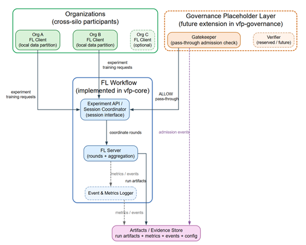

# Open Health / VFP Federated Computing MVP

This repository provides a minimal, open, reproducible baseline scaffold for **Federated Computing infrastructure** in the Open Health / VFP context.

The MVP is intentionally small. Its purpose is to demonstrate a local federated execution path using Docker services managed by OpenTofu, with a real biomedical educational dataset and a clear evidence trail.

## Purpose

The project provides a reference scaffold for:

- Federated Computing infrastructure education;
- reproducible federated-learning experiments;
- Open Health MVP development;
- future AWS/OpenTofu deployment;
- future FCaC-style governance extensions.

The MVP is **not** a production Open Health platform.

## Architectural split

The repository separates the working federated infrastructure from future governance work.

| Module | Role in this MVP | Status |
|---|---|---|
| `vfp-core` | Runs the federated infrastructure and FL workload | Implemented by the MVP |
| `vfp-governance` | Provides a placeholder admission/governance seam | Pass-through only |
| `infra/opentofu/local-docker` | Provisions local Docker services using OpenTofu | First deployment target |
| `infra/opentofu/aws` | Future AWS/OpenTofu deployment target | Planned |
| `datasets/medmnist` | Dataset preparation and partitioning | Planned |
| `experiments/medmnist-baseline` | Reproducible baseline experiment configuration | Planned |
| `runs/` | Run artefacts: metrics, events, configs, outputs | Generated at runtime |

## Documentation

- [API contract](src/docs/api_contract.md)
- [Static dashboard usage](src/docs/static_dashboard.md)


## Implemented MVP architecture

The implemented MVP should be interpreted as an FL infrastructure baseline rather than as a complete OpenHealth governance platform. It validates the execution and evidence path required for federated health-data experimentation, while governance-as-code and FCaC-style verifiable admission remain future extensions.



**implemented OpenHealth / VFP MVP architecture:** The current implementation provides a reproducible local Federated Learning infrastructure scaffold using OpenTofu-managed Docker services, a Flower-based federated-learning backend, MedMNIST/PneumoniaMNIST partitions across simulated organisations, hub-controlled experiment activation, metrics capture, lifecycle event logging, and a lightweight static dashboard. Governance is represented only as a pass-through extension point (`vfp-governance`) and is not enforced in the present implementation.


## Quick start

See the [API contract](src/docs/api_contract.md) and [static dashboard usage](src/docs/static_dashboard.md) for local execution and dashboard usage

The local MVP is deployed from:

```bash
cd src/infra/opentofu/local-docker
tofu init
tofu apply -auto-approve
```

## What this MVP implements

### Milestone 1 — Local OpenTofu/Docker FL baseline
Milestone 1 proves that the MVP can execute a reproducible federated-learning experiment over a biomedical educational dataset and generate inspectable evidence artefacts.

 
This milestone is a local OpenTofu-managed Docker deployment with:
- local OpenTofu-managed Docker deployment;
- Flower/FedAvg execution;
- two simulated organisations: `org_a` and `org_b`;
- MedMNIST/PneumoniaMNIST as the biomedical educational dataset;
- dataset partitioning across the two organisations;
- local training on each client;
- aggregation by the Flower server;
- metrics generation;
- event logging;
- dataset split summary generation;
- run artefacts stored under `runs/<run_id>/`.

Limitations of Milestone 1:
- clients start according to container startup order;
- experiment activation is not yet controlled by the hub;
- the frontend is not yet implemented;
- vfp-governance is pass-through only;
- FCaC is not implemented.
The local MVP uses OpenTofu with the `kreuzwerker/docker` provider to provision Docker services. This establishes the same infrastructure-as-code workflow that can later be extended to AWS.

## What this MVP does not implement

This MVP does **not** implement:

- FCaC;
- cryptographic admission control;
- signed capability tokens;
- proof-of-possession;
- healthcare consent workflows;
- production governance-as-code;
- differential privacy;
- secure aggregation;
- homomorphic encryption;
- trusted execution environments;
- EHR/FHIR/DICOM integration;
- production UX;
- clinical validation.

`vfp-governance` is included only as an explicit future extension point.

## Governance placeholder

In the MVP, `vfp-governance` operates in pass-through mode.

Example response:

```json
{
  "decision": "ALLOW",
  "mode": "pass_through",
  "reason": "vfp-governance placeholder: FCaC verification not enabled"
}
```

### Milestone 2: hub-controlled experiment activation
This Milestone removes startup timing assumptions from the local MVP.

OpenTofu still provisions the local Docker substrate and starts the services, but the experiment lifecycle is now controlled by the `vfp-core` hub.

Runtime flow:

```
tofu apply
  ├── starts vfp-governance-gatekeeper
  ├── starts vfp-core-hub
  ├── starts vfp-core-flower-server
  └── starts vfp-core-flower-client-org_a / org_b

clients
  ├── register with the hub
  └── wait for experiment activation

user / CLI / future frontend
  └── POST /experiments/{run_id}/start

hub
  └── sets experiment status to running

clients
  └── connect to Flower server and run the FL experiment
```

### Milestone 3 — Static MVP dashboard

Status: completed.

Milestone 3 adds a minimal static dashboard for the local OpenHealth / VFP MVP. The dashboard is served as a lightweight nginx frontend and exposes the current one-run lifecycle: `waiting → running → completed`.

The dashboard provides:

- experiment START control through the hub API;
- live auto-polling of experiment status;
- registered client status;
- round progress;
- metrics table for loss, accuracy, train loss, and train accuracy;
- lifecycle/event timeline;
- experiment configuration view;
- evidence artefact summary;
- explicit governance status: `vfp-governance` pass-through, FCaC not enabled.

This milestone intentionally avoids a complex frontend framework. The dashboard is an evidence viewer for the FL infrastructure MVP, not a production OpenHealth application UI.

Limitations:

- one run lifecycle only;
- no reset/new-run from the UI;
- experiment parameters are displayed but not yet fully editable;
- metrics are table-based rather than graph-based;
- Grafana/Prometheus observability is deferred to a later milestone.

### Milestone 3.2 — React/Vite dashboard

Status: completed.

Milestone 3.2 replaces the original static dashboard with the current React/Vite dashboard while preserving the same local MVP scope. The dashboard remains a lightweight one-run control and evidence view, but now provides a more maintainable frontend structure and richer metric presentation.

This milestone adds:

- React/Vite frontend served through the existing nginx container;
- START/status/events/configuration/evidence views preserved from the static dashboard;
- editable `Rounds` and `Local epochs` before experiment start;
- Recharts-based accuracy and loss charts over rounds;
- fixed x-axis round range based on the configured total rounds;
- the existing metrics table retained below the charts;
- safe handling of missing metric values while rounds are still in progress.

This remains a frontend-focused MVP dashboard. It does not introduce Grafana, Prometheus, authentication, or additional services.

### Milestone 3.3 — Reset-safe local runs

Status: completed.

Milestone 3.3 makes repeated local demo runs reliable after a completed experiment. It hardens the reset/start lifecycle so the same OpenTofu-managed Docker stack can be reset, restarted, and used for another run without stale metrics, stale hub state, or client registration loss.

This milestone adds:

- `/experiments/initialise` resets run artefacts and runtime state safely;
- metrics are cleared to a header-only file before a new run;
- waiting client registrations are preserved when START reapplies the current config;
- clients re-register if they detect that the hub no longer lists them;
- Flower clients retry transient connection failures while the server gRPC listener is starting;
- the Flower server waits cleanly for hub activation and avoids noisy restart loops after terminal runs;
- local hub/frontend examples use port `8082` to avoid host port collisions.

Recommended reset command for a final local check:

```bash
cd src/infra/opentofu/local-docker
tofu apply \
  -replace=docker_container.hub \
  -replace=docker_container.flower_server \
  -replace='docker_container.flower_client["org_a"]' \
  -replace='docker_container.flower_client["org_b"]' \
  -auto-approve
```

After reset, open `http://localhost:3000`, wait for `Registered clients 2 / 2`, then press **START EXPERIMENT**.
