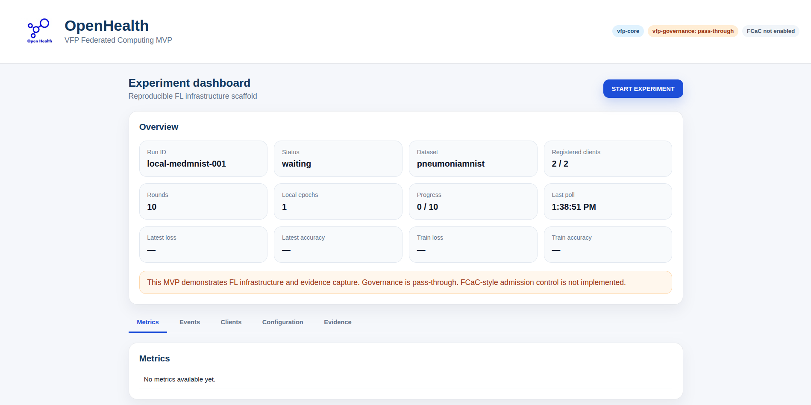

# Static MVP Dashboard

This document describes the Milestone 3 static dashboard for the OpenHealth / VFP Federated Computing MVP.

The dashboard is a lightweight evidence viewer for the local MVP. It is not a production OpenHealth application UI. Its purpose is to make the local FL infrastructure run visible without using terminal commands for every inspection step.

## Purpose

The dashboard provides a simple interface to:

- inspect the current experiment state;
- start the local experiment through the hub API;
- monitor client registration;
- observe round progress;
- inspect metrics;
- inspect lifecycle and governance-placeholder events;
- view experiment configuration;
- show the expected evidence artefacts.

The dashboard is intentionally minimal. It is implemented as a static HTML page served by nginx, with browser-side JavaScript calling the hub API through an nginx `/api` proxy.

## Access

After starting the local MVP with OpenTofu:

```bash
cd src/infra/opentofu/local-docker
tofu apply -auto-approve
```
open:
```
http://localhost:3000
```




The frontend container is:

```
vfp-core-frontend
```

The dashboard communicates with the hub through:
```
/api/... → vfp-core-hub:8080
Dashboard layout
```
The Milestone 3 dashboard contains the following sections.

### Header

The header identifies the MVP and displays the scope badges:
```
vfp-core
vfp-governance: pass-through
FCaC not enabled
```
These badges are part of the scope discipline of the MVP. They make clear that the current implementation demonstrates FL infrastructure and evidence capture, not FCaC-style governance enforcement.

### Overview

The overview cards show:
```
run ID;
experiment status;
dataset;
registered clients;
configured rounds;
local epochs;
round progress;
last poll timestamp;
latest loss;
latest accuracy;
latest train loss;
latest train accuracy.
```
The dashboard auto-polls the hub API. The Last poll field indicates when the frontend last refreshed its view of the backend state.

### START control

The START EXPERIMENT button calls:
```
POST /api/experiments/{run_id}/start
```
The button is enabled only when the hub reports that the run can start.

The current lifecycle is:
```
waiting → running → completed
```
After the run reaches completed, the button remains disabled. Milestone 3 supports a single run lifecycle only.

### Metrics

The metrics section displays the metric rows exported by the Flower/FedAvg run.

Current metrics include:
```
round;
fit client count;
evaluation client count;
loss;
accuracy;
train loss;
train accuracy.
```
In Milestone 3 these metrics are shown as a table. Graph rendering is deferred to a later milestone.

### Events

The events section shows lifecycle and governance-placeholder events from the run event log.

Events may include:
```
hub startup;
experiment initialization;
client registration;
admission checks;
experiment start;
client activation;
fit start/completion;
evaluation completion;
aggregation;
server completion.
```
The event view is intended to provide a simple audit/evidence trace for the MVP.

### Clients

The clients section lists the simulated organisation nodes participating in the local run.

For the first MVP, the expected organisations are:
```
org_a
org_b
```
Each client corresponds to one local Flower client container and one dataset partition.

### Configuration

The configuration section displays the experiment configuration written by the hub.

Typical fields include:
```
run ID;
dataset;
dataset subset;
aggregation strategy;
number of rounds;
minimum clients;
local epochs;
batch size;
learning rate;
governance mode;
FCaC enabled flag;
participating organisations.
Evidence
```
The evidence section lists the expected artefacts for the run.

Expected artefacts include:

experiment_config.json
participants.json
dataset_split_summary.csv
metrics.csv
events.jsonl
final_model_metadata.json
README_reproduce_this_run.md

These artefacts are written under:
```
runs/<run_id>/
```
inside the shared Docker volume used by the local MVP.

### Usage flow

A normal Milestone 3 usage flow is:
```
Deploy the local MVP:
cd src/infra/opentofu/local-docker
tofu apply -auto-approve
Open the dashboard:
http://localhost:3000
Wait until the dashboard shows:
Status: waiting
Registered clients: 2 / 2
Click:
START EXPERIMENT
Watch the status change:
waiting → running → completed
Inspect:
metrics table;
event timeline;
clients;
configuration;
evidence artefacts.
CLI equivalents
```
The dashboard START button is equivalent to:
```
curl -X POST http://localhost:3000/api/experiments/local-medmnist-001/start
```
The dashboard status view is based on:
```
curl http://localhost:3000/api/experiments/local-medmnist-001/status
```
Metrics are based on:
```
curl http://localhost:3000/api/experiments/local-medmnist-001/metrics
```
Events are based on:
```
curl http://localhost:3000/api/experiments/local-medmnist-001/events
Limitations
```
Milestone 3 intentionally keeps the dashboard simple.

### Current limitations:
```
one run lifecycle only;
no reset/new-run button;
no full experiment parameter editing;
no graph rendering yet;
no Grafana/Prometheus integration;
no authentication;
no production UI behavior;
no FCaC implementation.
```
Reusable experiment execution, editable parameters, graph rendering, and optional Grafana/Prometheus observability are deferred to a later milestone.

